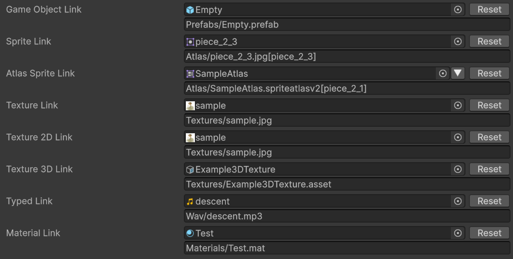
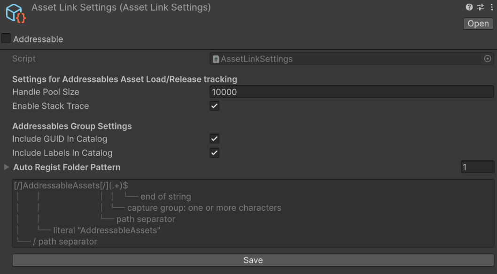
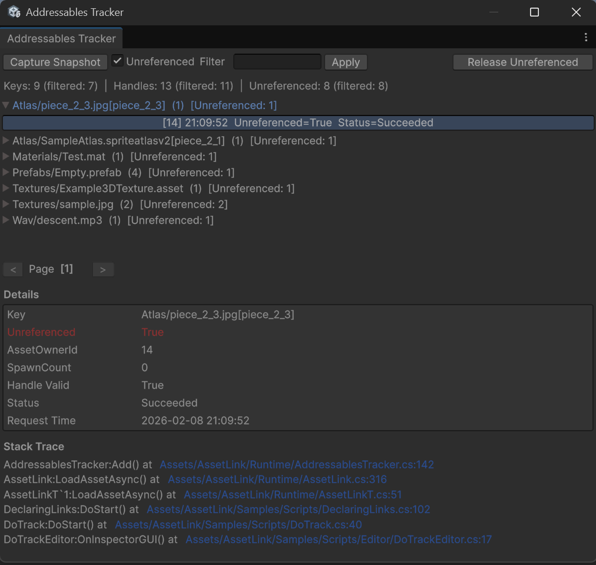

# xpTURN.AssetLink

A library that reimplements Unity Addressables' `AssetReference`. `AssetLink` lets you reference addressable assets by name (address) and load/instantiate them the same way as `AssetReference`. We created `AssetLink` despite the existing `AssetReference` for the following reasons:

- **Name instead of GUID**: `AssetReference` uses GUIDs to manage assets, which are hard to work with. `AssetLink` uses Addressable names, enabling data-driven load/unload. (You can dynamically map prefabs, icons, and other resources based on monster/item data or packet values.)
- **GUID reference also supported**: We provide `AssetRef`, which references assets by GUID like `AssetReference`. Resource handle tracking is supported.
- **Memory leak detection**: `Addressables` can leak memory when load/release pairs are mismatched. We provide an analysis tool to find such mismatches.
- **Automatic instance management**: References to `Instantiated` GameObjects are managed automatically. Release is called automatically, so you don't need to call `ReleaseInstance` manually.

### AssetLink Inspector



## Table of Contents

- [Requirements](#requirements)
- [Installing the AssetLink Package](#installing-the-assetlink-package)
- [Features](#features)
  - [AssetLink](#assetlink)
  - [AssetRef](#assetref)
  - [AssetLinkSpawner / AssetRefSpawner](#assetlinkspawner--assetrefspawner)
  - [Provided Types](#provided-types)
  - [Other](#other)
- [AssetLink, AssetRef Usage](#assetlink-assetref-usage)
- [AssetLinkSpawner Usage](#assetlinkspawner-usage)
- [AssetLinkScene(AssetRefScene) Usage](#assetlinksceneassetrefscene-usage)
- [Memory Leak Detection](#memory-leak-detection)
- [AssetLink Settings](#assetlink-settings)
- [Addressables Tracker](#addressables-tracker)
- [License](#license)
- [Links](#links)

---

## Requirements

- **Unity**: 2023.1 or later
- **Dependencies**
  - [Addressables](https://docs.unity3d.com/Packages/com.unity.addressables@2.8) 2.8.1
  - [Editor Coroutines](https://docs.unity3d.com/Packages/com.unity.editorcoroutines@1.0) 1.0.1 (required for the analysis tool)
  - [UniTask](https://github.com/Cysharp/UniTask) 2.5.10 (required when using `AssetLinkSpawner`/`AssetRefSpawner` and Samples/Tests)

## Installing the AssetLink Package

1. Open Window > Package Manager
2. Click the '+' button > Select "Add package from git URL..."
3. Enter the following URL:

```text
https://github.com/xpTURN/AssetLink.git?path=src/AssetLink2/Assets/AssetLink
```

## Features

### AssetLink

References assets by Addressable name (address). Changing the name can break or lose references. In return, you can dynamically map resources at runtime based on data or packet information.

### AssetRef

References assets by GUID. The same asset is referenced even if the asset name changes. Dynamic mapping at runtime is not supported.

### AssetLinkSpawner / AssetRefSpawner

Lightweight prefab instantiation. Addressable load handles are managed automatically, so manual release is not required. With `AssetLink.InstantiateAsync` or `AssetRef.InstantiateAsync`, each instantiation creates a 1:1 resource handle, which can add noticeable overhead. Spawner classes keep a single handle, so handle management cost is minimal. The code is enabled automatically when the UniTask package is installed.

- Adding a `DoAutoRelease` component to prefabs reduces overhead when instantiating.

#### Installing UniTask (Optional)

1. Open Window > Package Manager
2. Click the '+' button > Select "Add package from git URL..."
3. Enter the following URL:

```text
https://github.com/Cysharp/UniTask.git?path=src/UniTask/Assets/Plugins/UniTask
```

- `AssetLinkSpawner`/`AssetRefSpawner` cannot be used without the UniTask package.

### Provided Types

- **Reference (name) types**: `AssetLink`, `AssetLinkT<T>`
- **Specialized types**: `AssetLinkGameObject`, `AssetLinkSprite`, `AssetLinkTexture`, `AssetLinkTexture2D`, `AssetLinkTexture3D`, `AssetLinkAtlasedSprite`, `AssetLinkScene`, etc.
- **Reference (GUID) types**: `AssetRef`, `AssetRefT<T>`
- **Specialized types**: `AssetRefGameObject`, `AssetRefSprite`, `AssetRefTexture`, `AssetRefTexture2D`, `AssetRefTexture3D`, `AssetRefAtlasedSprite`, `AssetRefScene`, etc.
- **Spawners**: `AssetLinkSpawner`, `AssetRefSpawner` — prefab instantiation and management

### Other

- Custom Property Drawers for the editor, similar to `AssetReference`. Drag and drop or object picker are supported.
- `AddressablesTracker` for tracking and diagnostics. (Editor and PlayMode only.)
- The `AssetReferenceUILabelRestriction` attribute restricts the inspector to addressable assets with specific labels.

## AssetLink, AssetRef Usage

```csharp
using UnityEngine;

using Cysharp.Threading.Tasks;

using xpTURN.AssetLink;

public class ExampleSimple : MonoBehaviour
{
    [Header("AssetLink (name-based)")]
    public AssetLinkGameObject prefabLink;
    public AssetLinkSprite spriteLink;

    [Header("AssetRef (GUID-based)")]
    public AssetRefGameObject prefabRef;
    public AssetRefSprite spriteRef;

    private GameObject goCat;
    private GameObject goDog;
    private Sprite spriteCat;
    private Sprite spriteDog;

    async void LoadSprite()
    {
        // Call when dynamic mapping is needed (asset name, sprite name)
        spriteLink.SetAssetName("sprites/cats_maine_coon", "cats_maine_coon");
        spriteCat = await spriteLink.LoadAssetAsync().ToUniTask();

        // Dynamic mapping not supported
        spriteDog = await spriteRef.LoadAssetAsync().ToUniTask();
    }

    async void InstantiatePrefab()
    {
        goCat = await prefabLink.InstantiateAsync().ToUniTask();
        goDog = await prefabRef.InstantiateAsync().ToUniTask();
    }

    void OnDestroy()
    {
        // Release loaded assets
        if (spriteLink.IsValid())
            spriteLink.ReleaseAsset();

        // Release loaded assets (omission causes memory leak)
        // if (spriteRef.IsValid())
        //     spriteRef.ReleaseAsset();

        // ReleaseInstance is called automatically (by DoAutoRelease component when OnDestroy fires)
        GameObject.Destroy(goCat);
        GameObject.Destroy(goDog);

        // For instances created with AssetReference.InstantiateAsync,
        // AssetReference.ReleaseInstance() must be called (omission causes memory leak)
    }
}
```

- **Note:** In the example above, the `ReleaseAsset` call is intentionally omitted for the commented-out `spriteRef`. In real code you must call `ReleaseAsset` where appropriate.

## AssetLinkSpawner Usage

```csharp
using System.Collections.Generic;

using UnityEngine;

using Cysharp.Threading.Tasks;

using xpTURN.AssetLink;

public class ExampleSpawner : MonoBehaviour
{
    public AssetLinkSpawner prefabSpawner;

    private List<GameObject> goCats = new();

    async void Start()
    {
        for (int i = 0; i < 100; ++i)
        {
            var goCat = await prefabSpawner.SpawnAsync();
            goCat.name = $"Cat{i:d3}";

            goCats.Add(goCat);
        }
    }

    void OnDestroy()
    {
        // Instances created with SpawnAsync(InstantiateAsync) are released automatically when destroyed; no need to manage the prefab handle or call ReleaseInstance manually
        foreach (var goCat in goCats)
        {
            // ReleaseInstance is called internally
            // Handled by DoAutoRelease component when OnDestroy fires
            GameObject.Destroy(goCat);
        }
    }
}
```

- **Note:** Instances created with SpawnAsync(InstantiateAsync) are released automatically when destroyed; no need to manage the prefab handle or call ReleaseInstance manually.

## AssetLinkScene(AssetRefScene) Usage

Use `AssetLinkScene` or `AssetRefScene` to load Addressable scenes. Call `UnLoadScene()` when the scene is no longer needed (e.g. in `OnDestroy`).

```csharp
using UnityEngine;
using UnityEngine.SceneManagement;

using Cysharp.Threading.Tasks;

using xpTURN.AssetLink;

public class ExampleScene : MonoBehaviour
{
    [Header("AssetLinkScene (name-based)")]
    public AssetLinkScene sceneLink;

    async void Start()
    {
        // Load scene additively (optional: await handle.ToUniTask() for completion)
        sceneLink.LoadSceneAsync(LoadSceneMode.Additive, activateOnLoad: true, priority: 100);
    }

    void OnDestroy()
    {
        // Unload scene (omission causes memory leak)
        if (sceneLink.IsValid())
            sceneLink.UnLoadScene();
    }
}
```

- **Note:** You must call `UnLoadScene()` when a scene loaded with `LoadSceneMode.Additive` is no longer needed.
- **Note:** When loading with `LoadSceneMode.Single`, the previous scene is unloaded automatically; you do not need to call `UnLoadScene()` manually.

## Memory Leak Detection

```csharp
using System;
using UnityEngine;

using Cysharp.Threading.Tasks;
using xpTURN.AssetLink;

// Intentionally load without release (creates leak scenario).
// In real game code, always call Release (ReleaseAsset) for loaded assets.
public class LeakScenario : MonoBehaviour
{
    AssetLink ObjectLink_001 = new AssetLink();
    AssetLink ObjectLink_002 = new AssetLink();
    AssetLink ObjectLink_003 = new AssetLink();
    AssetLink ObjectLink_004 = new AssetLink();
    AssetLink ObjectLink_005 = new AssetLink();

    async void Start()
    {
        ObjectLink_001.SetAssetName("Prefabs/Cat1.prefab");
        await ObjectLink_001.LoadAssetAsync<GameObject>().ToUniTask();

        ObjectLink_002.SetAssetName("Prefabs/Cat2.prefab");
        await ObjectLink_002.LoadAssetAsync<GameObject>().ToUniTask();

        ObjectLink_003.SetAssetName("Prefabs/Cat3.prefab");
        await ObjectLink_003.LoadAssetAsync<GameObject>().ToUniTask();

        ObjectLink_004.SetAssetName("Prefabs/Cat4.prefab");
        await ObjectLink_004.LoadAssetAsync<GameObject>().ToUniTask();

        ObjectLink_005.SetAssetName("Prefabs/Cat5.prefab");
        await ObjectLink_005.LoadAssetAsync<GameObject>().ToUniTask();
    }

    void OnDestroy()
    {
        // Release loaded assets; ReleaseAsset intentionally omitted for testing
        // if (ObjectLink_001.IsValid())
        //     ObjectLink_001.ReleaseAsset();
        // if (ObjectLink_002.IsValid())
        //     ObjectLink_002.ReleaseAsset();
        // if (ObjectLink_003.IsValid())
        //     ObjectLink_003.ReleaseAsset();
        // if (ObjectLink_004.IsValid())
        //     ObjectLink_004.ReleaseAsset();
        // if (ObjectLink_005.IsValid())
        //     ObjectLink_005.ReleaseAsset();

        // Link objects removed without Release
        ObjectLink_001 = null;
        ObjectLink_002 = null;
        ObjectLink_003 = null;
        ObjectLink_004 = null;
        ObjectLink_005 = null;
    }
}
```

```csharp
using System;
using UnityEngine;

using Cysharp.Threading.Tasks;
using xpTURN.AssetLink;

public class DoTrack : MonoBehaviour
{
    async void DetectAndReportLeaks()
    {
        // Run GC
        GC.Collect();
        GC.WaitForPendingFinalizers();

        // Unload unused assets
        await Resources.UnloadUnusedAssets().ToUniTask();
        await UniTask.DelayFrame(2);

        // Run GC
        GC.Collect(GC.MaxGeneration, GCCollectionMode.Forced);
        GC.WaitForPendingFinalizers();

        await UniTask.WaitForSeconds(0.1f);

        // Log Link/Ref that leaked due to missing Release
        // Use error log to fix code (add ReleaseAsset() calls)
        AddressablesTracker.ReportUnreferencedHandles();

        // Log Link/Ref that leaked & force ReleaseAsset (fallback)
        // But not release the handles that are assets of scene links. (Too dangerous…)
        AddressablesTracker.ReleaseUnreferencedHandles(true);
    }
}
```

- **Note:** `ReleaseUnreferencedHandles` is a last resort. Use `ReportUnreferencedHandles` or the **Addressables Tracker** window to find leak entries, then fix your code to call `ReleaseAsset` where appropriate.

## AssetLink Settings

1. Open Window > AssetLink > AssetLink Settings
2. On first run, a dialog appears to create the AssetLinkSettings asset.
3. (It is automatically added to Player Settings > Player > Preloaded Assets so the settings can be accessed in both Editor and Player.)

- **Handle Pool Size**: Size of the handle pool used to track addressable resources. Set according to your project's resource scale.
- **Enable Stack Trace**: Store stack trace when LoadAssetAsync is called. Should be disabled in release builds.

- **Include GUID In Catalog**: Required when using `AssetRef` types. (Applies to folders under Auto Regist Folder Pattern.)
- **Include Labels In Catalog**: Required when using labels. (Applies to folders under Auto Regist Folder Pattern.)
- **Auto Regist Folder Pattern**: Register folder rules with a regex; group name and addressable asset name are then set from subfolder and file name. (Applied on new import or reimport.)

### AssetLink Settings Inspector



## Addressables Tracker

1. Enter PlayMode
2. Open Window > AssetLink > Addressables Tracker
3. Click Capture Snapshot
4. Check Unreference Filter to see potential memory leak entries
5. Enter the asset name to search in the text box and click Apply

- Only assets loaded via AssetLink/AssetRef are tracked. (Assets loaded with `AssetReference` are not tracked.)
- Tracking is not available after assembly reload in PlayMode.

### Addressables Tracker Window



### Known Issues

#### Running Samples / Tests

Some Samples and Tests run only when Sprite Atlas is available. To run them, follow the steps below.

1. Install **2D Sprite** via `Window > Package Manager`
2. In `Edit > Project Settings... > Editor`, set **Sprite Atlas > Mode** from `Disabled` to `Sprite Atlas V2 - Enabled`

## License

This project was created by referencing/copying code related to `AssetReference` from the Addressables package. That code is under the Unity Companion License. See [Unity Companion License](http://www.unity3d.com/legal/licenses/Unity_Companion_License) for details.

The rest of the xpTURN.AssetLink code is under the Apache License, Version 2.0. See [LICENSE](./LICENSE.md) for details.

## Links

- **Changelog**: [CHANGELOG](./CHANGELOG.md)
- **License**: [LICENSE](./LICENSE.md)
- **Author**: [xpTURN](https://github.com/xpTURN)
